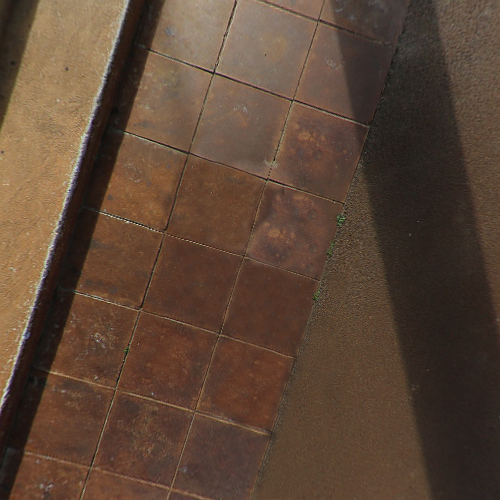

# panorama2cubemap

## interface

    bool pano2cube(std::string inpath, std::vector<std::string>& outpaths, int width = -1);
    

outpaths 6 face order: +X, -X, +Y, -Y, +Z, -Z

    +X right
    -X left
    +Y top 
    -Y bottom
    +Z front
    -Z back
    
correspond to OpenGL define:

    GL_TEXTURE_CUBE_MAP_POSITIVE_X
    GL_TEXTURE_CUBE_MAP_NEGATIVE_X
    GL_TEXTURE_CUBE_MAP_POSITIVE_Y
    GL_TEXTURE_CUBE_MAP_NEGATIVE_Y
    GL_TEXTURE_CUBE_MAP_POSITIVE_Z
    GL_TEXTURE_CUBE_MAP_NEGATIVE_Z 
    
## build test code

require install opencv first, for macos:
    
    brew install opencv

test code at the tail of the cpp file

    mkdir build && cd build
    cmake ..
    make -j12

run command:

    pano2cube pano.jpg

generate:

    pano0.png pano1.png pano2.png pano3.png pano4.png pano5.png

## test result

there is test code in the file, read auto_stop_spherical_pano.jpg and generate 6 faces.

test image:

generated image is:

    src/auto_stop_spherical_pano0.png
    src/auto_stop_spherical_pano1.png
    src/auto_stop_spherical_pano2.png
    src/auto_stop_spherical_pano3.png
    src/auto_stop_spherical_pano4.png
    src/auto_stop_spherical_pano5.png

a correct result can be found in:

    src/correct_result/auto_stop_spherical_pano0.png
    src/correct_result/auto_stop_spherical_pano1.png
    src/correct_result/auto_stop_spherical_pano2.png
    src/correct_result/auto_stop_spherical_pano3.png
    src/correct_result/auto_stop_spherical_pano4.png
    src/correct_result/auto_stop_spherical_pano5.png

left

front

right

back

top

bottom

